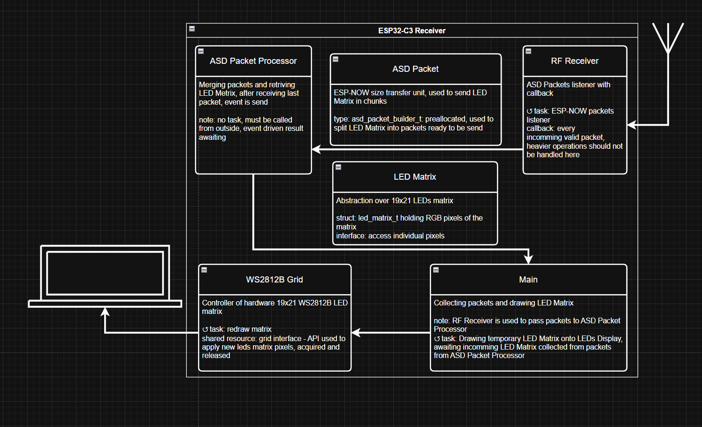

# 399 LEDs RF controller

399 WS2812B programmable LEDs driver controller via ESPNOW WiFi packets. 

This controller receives broadcasted packets containing data of LED matrix pixels, then collects them into complete LED Matrix data and converts it to LEDs controlling SPI waveform.

Architecture diagram:

  

The controller's firmware consists of several FreeRTOS (ESP-IDF) task. Data is passed between tasks using queue, handlers and event flags to achieve maintainability and efficient usage of RTOS.